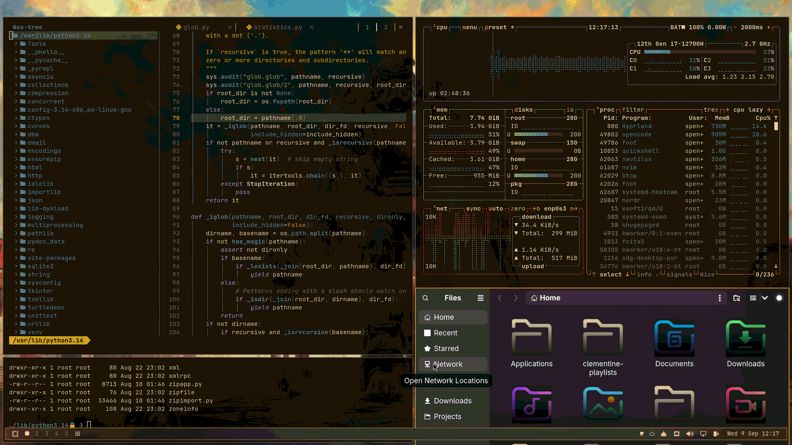

# Omarchy Fallout Theme

A full [Omarchy](https://omarchy.org) desktop theme built around the
Fallout game series: wasteland dusk skylines with power-armored silhouettes,
rendered in a rust/amber warning-light palette. The accent is deliberately
not Pip-Boy green or Brotherhood-of-Steel red.



> **About the preview:** this thumbnail is not a mock-up — it is a real
> 1920x1080 screenshot of this theme running live (amber nvim via
> `theme/neovim.lua`, BeautyLine-Fallout home-folder icons, the
> 1-power-armor-dogmeat wallpaper), captured with the compositor's cursor
> auto-hidden so no mouse/hover artifacts appear, then cropped/shrunk to
> 1800x1012.

Designed and tested on Omarchy specifically — don't assume it works
unmodified on a plain Hyprland/GTK setup.

## What this actually is

- **Four 4K wallpapers** from official Fallout artwork (see
  `theme/backgrounds/`): `1-power-armor-dogmeat.jpg` (the current default —
  a man in power armor with his dog, sun over the shoulder),
  `2-fallout-scene.jpg`, `3-wasteland-amber.jpg`, `4-fallout-656603.jpg`.
  Flip with the standard Omarchy background switcher (`SUPER` + `CTRL` +
  `SPACE`, or `omarchy-theme-bg-next`).
- **`theme/colors.toml`** — the palette every other themed app pulls from:
  dusty rust-brown darks, warm parchment foreground, `#D9822B` amber accent.
  Every ANSI/terminal color is tinted toward the same wasteland family
  (olive drab, faded steel, weathered patina) while staying readable in a
  real terminal.
- **File-manager icons** (`BeautyLine-Fallout`, *generated* from the
  `beautyline` AUR package — nothing is committed): default folders get a
  full parchment-to-black gradient, every other device/file-type icon keeps
  its own colors with a black fade at the bottom — the same technique as
  this author's Matrix theme. `generate_fallout_icons.py` regenerates the
  set from `theme/colors.toml`; `theme/icons.theme` points GTK apps at it.
- **Neovim colorscheme** — taken from `theme/colors.toml` at startup via
  Omarchy's standard `theme/neovim.lua` (aether spec built from the palette),
  so nvim inherits the theme's amber/rust colors directly. This repo does
  **not** use `shawilly/fallout.nvim`, which is Pip-Boy green and reads as
  Matrix-style green.
- **VS Code**: `theme/vscode.json` maps to the
  [`FcGod.fallout-pip-boy-theme`](https://marketplace.visualstudio.com/items?itemName=FcGod.fallout-pip-boy-theme)
  marketplace extension.
- **Lock screen**: `theme/unlock.png` is the OMARCHY wordmark recolored to
  the theme's accent.
- `theme/preview.png` — the theme-switcher thumbnail (see the note above).

## Requirements

- Omarchy (Hyprland).
- `python3` + `python-pillow` — needed only for the *optional* icon
  generation step. Nothing renders at install time and nothing else runs
  at runtime; the wallpapers are static images shipped in the repo.
- Optional but recommended: `beautyline` (AUR) to generate the themed
  folder/file icon set.

## Install

### Recommended: Omarchy's built-in installer

```bash
omarchy theme install https://github.com/tinterian/omarchy-fallout-theme.git
```

which clones the repo and applies the theme with `omarchy-theme-set`.

> **Note for theme authors / future we-build-themes:** `omarchy theme install`
> clones a repo *verbatim* into `~/.config/omarchy/themes/<name>` and never
> reads a README or runs scripts. It therefore expects the **repo root to
> already be the flat Omarchy theme layout** (`colors.toml`, `icons.theme`,
> `neovim.lua`, `vscode.json`, `unlock.png`, `preview.png`, `backgrounds/`).
> This repo currently ships its theme files under `theme/` with an
> `install.sh` that flattens them, so the built-in installer is **not** the
> supported path yet — until the repo is restructured flat, use the
> `install.sh` method below. The `theme/`-plus-installer shape also means a
> future migration is mechanical: move `theme/*` to the repo root. See the
> `## Layout contract` section.

### Current supported method: `install.sh`

```bash
git clone https://github.com/tinterian/omarchy-fallout-theme.git
cd omarchy-fallout-theme
./install.sh
```

`install.sh` copies the theme files into `~/.config/omarchy/themes/fallout/`
in the flat layout Omarchy expects, then optionally generates the icon set.
It never overwrites an existing file — safe to re-run. The only prompt is an
optional y/N if you want it to install `beautyline` for you.

Then select the theme:

```bash
omarchy-theme-set fallout
```

or pick "Fallout" from the Omarchy theme menu.

## Layout contract

Two shapes exist in the wild; know which one you're dealing with:

| Shape | Where files live | Installed by | Works with `omarchy theme install`? |
|---|---|---|---|
| **Flat** (stock & future) | repo root: `colors.toml`, `icons.theme`, `neovim.lua`, `vscode.json`, `unlock.png`, `preview.png`, `backgrounds/` | clone-to-`~/.config/omarchy/themes/<name>` | Yes — this is what Omarchy expects |
| **Nested** (this repo, current) | `theme/` subdir | `./install.sh` (flattens + generates icons) | No — needs the flat restructure |

`omarchy-theme-set` reads known filenames at the theme-dir **root only**, so
anything nested is simply invisible to it. Extra root files (README, LICENSE,
generators) are copied along but inert; dotfiles (`.git/`, `.gitignore`) are
excluded automatically.

The only post-install step that installers can't provide is icon generation:
`omarchy theme install` and `./install.sh` both stop short of building
`BeautyLine-Fallout`, because that needs the `beautyline` AUR package. Do it
once with:

```bash
yay -S --needed beautyline            # or: paru -S --needed beautyline
python3 generate_fallout_icons.py     # from the repo, after install.sh
```

## Theme components

| Path | What it does |
|---|---|
| `theme/colors.toml` | Core palette — every other file below derives from it |
| `theme/backgrounds/*.jpg` | Four official Fallout wallpapers |
| `theme/icons.theme` | Points GTK apps (Nautilus) at `BeautyLine-Fallout` |
| `theme/neovim.lua` | aether colorscheme spec built from `colors.toml` |
| `theme/vscode.json` | VS Code/VSCodium/Cursor extension + theme name |
| `theme/unlock.png` | Lock-screen OMARCHY wordmark, recolored |
| `theme/preview.png` | Theme-switcher thumbnail (real screenshot) |
| `generate_fallout_icons.py` | Regenerates `BeautyLine-Fallout` from an installed `beautyline` |
| `install.sh` | Copies `theme/*` into the flat target dir; optional icon generation |

## Customizing

`generate_fallout_icons.py` reads the fade colors from `theme/colors.toml`
(or `--theme-name another-omarchy-theme`) and takes `--top`/`--bottom`
overrides for the icon gradient. See its header comment for the design
before changing it.

To rebuild the theme merely restages the shipped art; nothing is generated at
install or runtime except the icon set.

## Uninstall

```bash
./uninstall.sh
```

Removes the generated `BeautyLine-Fallout` icon theme. Leaves
`~/.config/omarchy/themes/fallout/` in place — after switching to another
theme, remove that directory yourself to fully uninstall.

## License

MIT — see `LICENSE`.